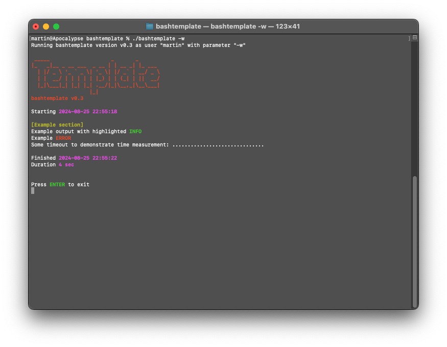

# domoTemplate

Base template for creating bash scripts.
This script helps with:

- Display of name and version
- Checking for needed tools
- Handling commandline parameters
- Measering used time
- Coloring of output
- Exiting with error
- Debugging output (if needed)
- Starting in GUI window (if needed)
- Waiting on exit (if needed)

