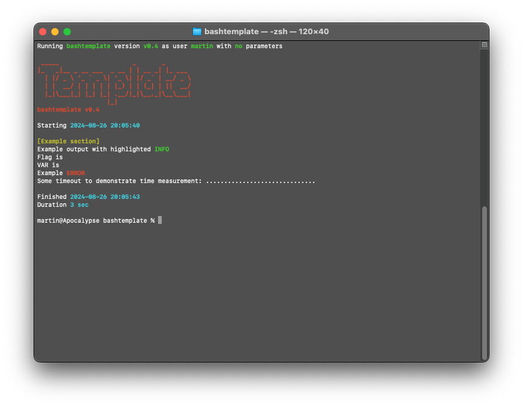

# bashtemplate

Template for creating bash scripts.
This script helps with:

- Display of name and version
- Checking for needed tools
- Handling of commandline parameters
- Measering used time
- Coloring of output
- Exiting with or without error
- Warning about empty variables
- Debugging output (if needed)
- Waiting on exit (if needed)

